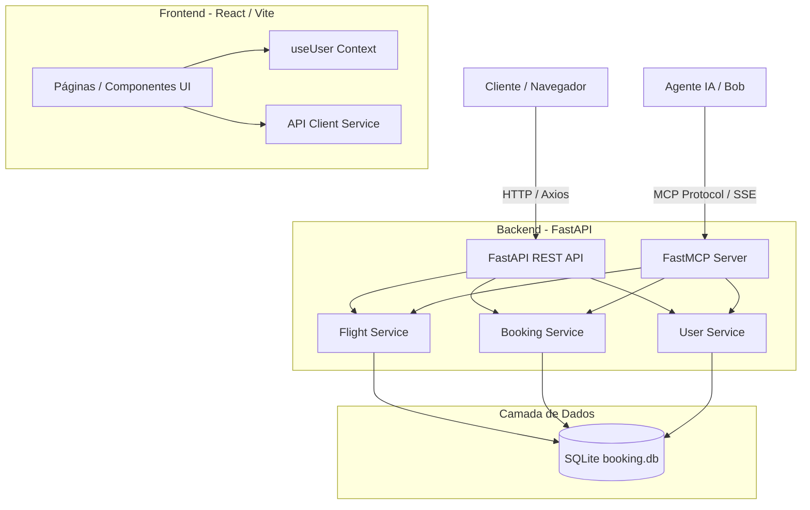
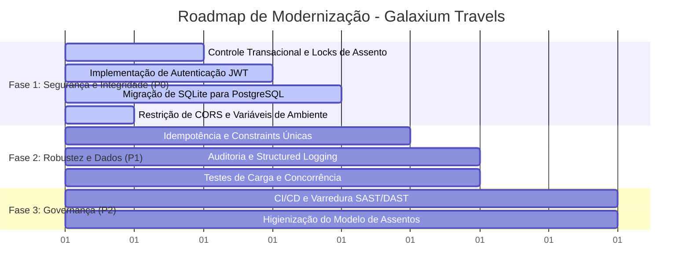

# Analise este sistema de viagens. Identifique:1. Os componentes principais e suas responsabilidades2. O fluxo de dados entre os modulos3. Os principais pontos de debitos tecnicos.4. Os maiores riscos operacionais5. As dependencias criticas (internas e externas)Gere um relatorio executivo em portugues, formatado em markdown adequado para apresentar a lideres de negocio e tecnicos.

---

**Status:** active  **Date:** 2026-09-23

---

### 👤 User

Analise este sistema de viagens. Identifique:1. Os componentes principais e suas responsabilidades2. O fluxo de dados entre os modulos3. Os principais pontos de debitos tecnicos.4. Os maiores riscos operacionais5. As dependencias criticas (internas e externas)Gere um relatorio executivo em portugues, formatado em markdown adequado para apresentar a lideres de negocio e tecnicos.

---

### 🤖 Assistant

> 🔧 called: use_skill

> 🔧 **use_skill** — create-plan

### 🤖 Assistant

> 🔧 called: glob

> 🔧 **glob** — **/*

### 🤖 Assistant

> 🔧 called: spawn_subagent

> 🔧 **spawn_subagent** — explore

### 🤖 Assistant

# Relatório Executivo de Análise de Arquitetura e Engenharia: Galaxium Travels

## Sumário Executivo

O **Galaxium Travels** é uma solução *full-stack* moderna e desacoplada voltada para reservas de viagens espaciais interplanetárias. O sistema implementa uma interface web reativa em [React 19 com TypeScript](galaxium-travels/booking_system_frontend/package.json) e uma camada de serviços em [FastAPI com Python](galaxium-travels/booking_system_backend/server.py), suportando comunicação híbrida via **REST API** e protocolo **MCP (*Model Context Protocol*)** com persistência em [SQLite via SQLAlchemy](galaxium-travels/booking_system_backend/db.py).

Embora apresente boa legibilidade, separação em camadas e testes unitários/integrados funcionais para caminhos padrão (*happy paths*), a arquitetura atual exibe **vulnerabilidades críticas de concorrência (*race conditions*)**, **ausência de camada de autenticação/autorização**, **gargalos de escrita no banco de dados** e **débitos técnicos estruturais** que inviabilizam seu uso em ambiente de produção sem as devidas correções.

---

## 1. Componentes Principais e Suas Responsabilidades

O ecossistema é organizado em duas frentes principais (Frontend e Backend), com suporte a chamadas REST e ferramentas assistidas por IA (MCP).

### 1.1 Frontend (`booking_system_frontend`)
- **Interface e Navegação**: Desenvolvido em React 19, TypeScript e Tailwind CSS com animações via Framer Motion. Rotas gerenciadas via [`App.tsx`](galaxium-travels/booking_system_frontend/src/App.tsx).
- **Gestão de Sessão/Usuário**: Contexto [`useUser.tsx`](galaxium-travels/booking_system_frontend/src/hooks/useUser.tsx) mantém estado do usuário ativo e sincroniza com `localStorage` em texto claro.
- **Catálogo e Reserva de Voos**: [`Flights.tsx`](galaxium-travels/booking_system_frontend/src/pages/Flights.tsx) e [`BookingModal.tsx`](galaxium-travels/booking_system_frontend/src/components/bookings/BookingModal.tsx) gerenciam a busca, filtros e o diálogo de reserva.
- **Gestão de Reservas do Passageiro**: [`MyBookings.tsx`](galaxium-travels/booking_system_frontend/src/pages/MyBookings.tsx) e [`BookingCard.tsx`](galaxium-travels/booking_system_frontend/src/components/bookings/BookingCard.tsx) realizam o carregamento de bilhetes e fluxo de cancelamento.
- **Camada de Integração HTTP**: [`api.ts`](galaxium-travels/booking_system_frontend/src/services/api.ts) encapsula chamadas Axios, tratando respostas de erro sem quebrar a renderização.

### 1.2 Backend (`booking_system_backend`)
- **Ponto de Entrada e Roteamento**: [`server.py`](galaxium-travels/booking_system_backend/server.py:117-190) instancia a aplicação FastAPI, configura CORS e expõe tanto as rotas REST quanto as ferramentas MCP montadas em `/mcp`.
- **Serviço de Voos**: [`services/flight.py`](galaxium-travels/booking_system_backend/services/flight.py:6-27) consulta e formata o inventário de voos e classes de assento (`economy`, `business`, `first_class`), calculando preços dinâmicos pelo multiplicador.
- **Serviço de Reservas**: [`services/booking.py`](galaxium-travels/booking_system_backend/services/booking.py:7-104) executa regras de negócio de alocação de assentos, validação de passageiro, criação e cancelamento de bilhetes.
- **Serviço de Usuários**: [`services/user.py`](galaxium-travels/booking_system_backend/services/user.py:6-32) efetua cadastro com validação de unicidade de e-mail e busca por nome/e-mail.
- **Modelos e Persistência**: [`models.py`](galaxium-travels/booking_system_backend/models.py:1-37) define as tabelas ORM (`users`, `flights`, `flight_seat_classes`, `bookings`) e [`db.py`](galaxium-travels/booking_system_backend/db.py:1-22) gerencia a sessão SQLAlchemy conectada ao arquivo SQLite local.
- **Carga de Dados Inicial**: [`seed.py`](galaxium-travels/booking_system_backend/seed.py:6-73) inicializa o banco com dados de teste na inicialização do servidor.

---

## 2. Fluxo de Dados Entre os Módulos

### 2.1 Identificação e Cadastro do Usuário
1. O usuário informa Nome e E-mail no modal [`UserIdentification.tsx`](galaxium-travels/booking_system_frontend/src/components/user/UserIdentification.tsx).
2. O frontend chama `POST /register` ou `GET /user` em [`api.ts`](galaxium-travels/booking_system_frontend/src/services/api.ts:52-70).
3. O [`user.py`](galaxium-travels/booking_system_backend/services/user.py:6-32) valida a duplicidade ou localiza o registro no banco de dados e retorna o identificador `user_id`.
4. O cliente armazena o payload no `localStorage` por meio do hook [`useUser`](galaxium-travels/booking_system_frontend/src/hooks/useUser.tsx).

### 2.2 Consulta de Voos e Disponibilidade
1. O componente [`Flights.tsx`](galaxium-travels/booking_system_frontend/src/pages/Flights.tsx) dispara requisição `GET /flights`.
2. O endpoint aciona [`flight.list_flights()`](galaxium-travels/booking_system_backend/services/flight.py:6-27).
3. A consulta recupera os voos e associa as classes em [`FlightSeatClass`](galaxium-travels/booking_system_backend/models.py:23-28), calculando os assentos disponíveis e o preço por classe (`price * price_multiplier`).
4. O retorno alimenta a grade de cartões com filtragem local (origem, destino, faixa de preço).

### 2.3 Fluxo Crítico de Reserva (*Booking*)
1. O passageiro seleciona a classe de assento no modal [`BookingModal.tsx`](galaxium-travels/booking_system_frontend/src/components/bookings/BookingModal.tsx) e confirma a reserva.
2. É enviado um `POST /book` com `user_id`, `name`, `flight_id` e `seat_class`.
3. O backend executa [`booking.book_flight()`](galaxium-travels/booking_system_backend/services/booking.py:7-67):
   - Valida existência do voo e da classe correspondente.
   - Verifica se `seats_available >= 1`.
   - Confirma a consistência entre o `user_id` e o `name` informado.
   - Decrementa `seats_available` na classe e persiste a nova reserva na tabela `bookings`.
   - Executa `db.commit()` e retorna os dados do bilhete gerado.

### 2.4 Cancelamento de Reserva
1. Na tela [`MyBookings.tsx`](galaxium-travels/booking_system_frontend/src/pages/MyBookings.tsx), o passageiro solicita cancelamento do bilhete.
2. Dispara `POST /cancel/{booking_id}` para o backend.
3. O método [`booking.cancel_booking()`](galaxium-travels/booking_system_backend/services/booking.py:70-98) verifica se o status não é `"cancelled"`, incrementa a disponibilidade do assento na classe de voo correspondente e atualiza o status para `"cancelled"`.

---

## 3. Principais Pontos de Débitos Técnicos

| Área | Arquivo / Linhas | Descrição do Débito Técnico | Impacto |
| :--- | :--- | :--- | :--- |
| **Concorrência** | [`services/booking.py:31, 56`](galaxium-travels/booking_system_backend/services/booking.py:31) | **Check-Then-Act & Decremento Não-Atômico**: A validação de disponibilidade e o decremento do assento são feitos em memória Python antes do commit, sem *locks* de linha (`with_for_update()`). | Sobreserva de voos (*overbooking*) quando duas pessoas reservam simultaneamente o último assento. |
| **Integridade de Dados** | [`models.py:20, 27`](galaxium-travels/booking_system_backend/models.py:20) | **Campos Redundantes de Assentos**: Existe `Flight.seats_available` (legado/desatualizado) e `FlightSeatClass.seats_available` (ativo). | Gera ambiguidade e riscos de inconsistência em consultas e relatórios. |
| **Tipagem / Enums** | [`schemas.py:34`](galaxium-travels/booking_system_backend/schemas.py:34), [`models.py:35`](galaxium-travels/booking_system_backend/models.py:35) | Classes de assento (`seat_class`) e status de reserva salvos como strings livres no banco, sem `Enum` restritivo nem *constraints*. | Risco de corrupção semântica de dados (ex: status inválido ou typo de classe). |
| **Tratamento de Erros** | [`server.py:40, 66, 80, 94`](galaxium-travels/booking_system_backend/server.py:40) | **Exceções Genéricas**: No protocolo MCP, erros de serviço disparam `raise Exception(result.error)`. | Dificuldade de instrumentação e monitoramento; poluição de *stack traces*. |
| **Observabilidade** | `services/`, `server.py` | Ausência de biblioteca de *structured logging*; o sistema utiliza apenas `print` pontual no *seed*. | Impossibilidade de rastrear incidentes ou auditorias de transação em produção. |
| **Reinicialização Não-Idempotente** | [`server.py:110`](galaxium-travels/booking_system_backend/server.py:110), [`seed.py:9-14`](galaxium-travels/booking_system_backend/seed.py:9) | O `seed()` apaga e recria todas as tabelas e dados fictícios a cada inicialização da aplicação FastAPI. | Perda de todos os dados de usuários e reservas reais a cada reinício do processo. |
| **Validação de Entrada** | [`UserIdentification.tsx:20-22`](galaxium-travels/booking_system_frontend/src/components/user/UserIdentification.tsx:20) vs [`schemas.py:11`](galaxium-travels/booking_system_backend/schemas.py:11) | A expressão regular de e-mail do frontend é mais permissiva que o validador `EmailStr` do Pydantic no backend. | Usuário recebe erro 200 de negócio inesperado sem validação prévia na UI. |

---

## 4. Maiores Riscos Operacionais e de Segurança

### 4.1 Insegurança por Ausência de Autenticação / Autorização (Risco Crítico)
- **Falta de Tokens/Sessões (JWT / OAuth2)**: Não há validação criptográfica de identidade. A aplicação confia cegamente no `user_id` enviado pelo frontend em chamadas como `POST /book` e `GET /bookings/{user_id}` ([`server.py:145-165`](galaxium-travels/booking_system_backend/server.py:145)).
- **Vulnerabilidade de IDOR / *Spoofing***: Qualquer cliente pode forjar um `user_id` de outro passageiro, listar todas as viagens do usuário ou cancelar reservas de terceiros ([`services/booking.py:70-98`](galaxium-travels/booking_system_backend/services/booking.py:70)).
- **Enumeração de Usuários**: O endpoint `GET /user` ([`server.py:175-178`](galaxium-travels/booking_system_backend/server.py:175)) aceita pares de nome e e-mail via *query parameters* para expor o `user_id`.

### 4.2 Bloqueio de Arquivo e Concorrência de Banco (SQLite em Produção)
- **Single-Writer Lock**: O banco está configurado em [`sqlite:///./booking.db`](galaxium-travels/booking_system_backend/db.py:5) sem o modo Write-Ahead Logging (`WAL`).
- Em cenários com múltiplos acessos concorrentes, escritas simultâneas causam bloqueio do arquivo (`database is locked`), resultando em lentidão extrema, travamento de transações e falhas operacionais com HTTP 500.

### 4.3 Configurações Abertas e Exposição de Rede
- **CORS Aberto Totalmente**: [`server.py:126`](galaxium-travels/booking_system_backend/server.py:126) utiliza `allow_origins=["*"]`, permitindo requisições de qualquer origem externa (risco de Cross-Site Request Forgery / abusos de API).
- **Binding de Rede**: O servidor roda por padrão em `0.0.0.0:8080` ([`server.py:190`](galaxium-travels/booking_system_backend/server.py:190)) sem camada TLS/HTTPS nativa.

### 4.4 Falta de Resiliência e Idempotência
- Sem mecanismo de chave de idempotência (`Idempotency-Key`) no endpoint de reservas, falhas de conexão ou cliques duplos do usuário resultam em **dupla cobrança/dupla reserva** para o mesmo assento.

---

## 5. Dependências Críticas

### 5.1 Dependências Internas (Acoplamento Entre Módulos)
- **Acoplamento Monolítico Direto**: [`server.py`](galaxium-travels/booking_system_backend/server.py) importa diretamente as funções de domínio de [`services/`](galaxium-travels/booking_system_backend/services/).
- **Dependência de Sessão por Ferramenta MCP**: Cada invocação de ferramenta MCP cria e descarta uma sessão independente via `SessionLocal()`, aumentando o *overhead* de I/O em SQLite.
- **Sincronia Forte entre Tabelas**: `Booking` possui chaves estrangeiras rígidas para `User` e `Flight`, porém sem comportamento de deleção em cascata (`ondelete` não configurado em [`models.py`](galaxium-travels/booking_system_backend/models.py)).

### 5.2 Dependências Externas

| Ecossistema | Pacote / Tecnologia | Versão Declarada | Papel no Sistema |
| :--- | :--- | :--- | :--- |
| **Backend** | `fastapi` | Recente | Framework web e documentação OpenAPI. |
| **Backend** | `fastmcp` | Recente | Servidor do protocolo MCP para consumo por agentes de IA. |
| **Backend** | `sqlalchemy` | Recente | Camada de ORM e abstração de banco de dados. |
| **Backend** | `pydantic[email]` | v2.x | Validação e tipagem de contratos de entrada/saída. |
| **Backend** | `uvicorn` | Recente | Servidor ASGI de execução assíncrona. |
| **Frontend** | `react` / `react-dom` | `19.2.0` | Biblioteca de renderização da interface web. |
| **Frontend** | `axios` | `1.13.2` | Cliente HTTP para consumo da API REST. |
| **Frontend** | `react-router-dom` | `7.12.0` | Roteamento client-side SPA. |
| **Frontend** | `framer-motion` | `12.26.1` | Biblioteca de animações e micro-interações visuais. |
| **Frontend** | `tailwindcss` | `3.4.19` | Framework de estilização utilitária. |
| **Infraestrutura** | `SQLite 3` | Embutido | Motor de banco de dados local em arquivo. |

---

## 6. Plano de Ação Recomendado para os Líderes Técnicos e de Negócio

Para elevar o nível de maturidade da solução de um **MVP/PoC** para um sistema **Enterprise-Ready**, recomenda-se a seguinte ordem de prioridades:

1. **Prioridade 0 (Imediata - Correção de Riscos Críticos)**:
   - Adicionar controle de transação com *lock* pessimista (`with_for_update()`) ou atômico (`UPDATE flight_seat_classes SET seats_available = seats_available - 1 WHERE id = :id AND seats_available > 0`) em [`booking.py`](galaxium-travels/booking_system_backend/services/booking.py).
   - Implementar autenticação via tokens JWT com senhas seguras (OAuth2 / OpenID Connect) e vincular o `user_id` da requisição ao *token* validado.
   - Migrar o banco para **PostgreSQL** e desativar o script de `seed()` destrutivo em produção.
   - Restringir CORS apenas aos domínios autorizados do frontend.

2. **Prioridade 1 (Curto Prazo - Estabilidade Operacional)**:
   - Implementar cabeçalho `Idempotency-Key` no fluxo de reserva.
   - Adicionar biblioteca de logs estruturados (JSON) com níveis de criticidade para rastreio de erros e auditoria de compras.
   - Criar suíte de testes de estresse e concorrência multithread para validação de integridade de assentos.

3. **Prioridade 2 (Médio Prazo - Limpeza Arquitetural e Governança)**:
   - Remover a coluna obsoleta `Flight.seats_available` e unificar a gestão exclusivamente em `FlightSeatClass`.
   - Adicionar Enums explícitos para classes de voo e status de bilhetes no Pydantic e no SQLAlchemy.