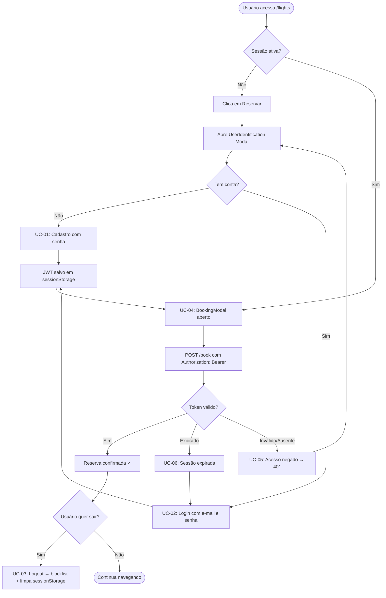

# Casos de Uso — Melhoria 1: Autenticação com Senha e Sessão Segura

> **Plataforma:** Galaxium Travels — Reservas de Voos Interplanetários
> **Funcionalidade:** Substituição do mecanismo de identificação por nome+e-mail por autenticação com senha (bcrypt) + sessão via JWT.
> **Data de geração:** 2025-07-25
> **Base:** [`GT_documentacao.md`](../galaxium-travels/GT_documentacao.md) + [`melhorias-priorizadas.md`](../evolucao-projeto/melhorias-priorizadas.md)

---

## Contexto e Problema que Motiva os Casos de Uso

O sistema atual identifica o usuário apenas por **nome + e-mail em texto simples**, armazenados no `localStorage` sem qualquer token ou sessão (`useUser.tsx`, chave `galaxium_user`). Qualquer pessoa que conheça o e-mail de outro usuário pode efetuar reservas ou cancelamentos em seu nome. Os casos de uso abaixo cobrem o novo fluxo proposto:

- Campo `password_hash` (bcrypt) adicionado ao modelo `User`
- Endpoint `POST /login` retorna **JWT** com expiração de 8 horas
- Middleware de autenticação nas rotas `/book`, `/cancel`, `/bookings/{user_id}`
- Token armazenado em `sessionStorage` (não `localStorage`)
- `POST /logout` invalida o token via blocklist em memória

---

## Lista de Casos de Uso

| ID | Nome | Ator Primário |
|----|------|---------------|
| UC-01 | Cadastrar conta com senha | Usuário Web |
| UC-02 | Fazer login com e-mail e senha | Usuário Web |
| UC-03 | Fazer logout e encerrar sessão | Usuário Web |
| UC-04 | Acessar rota protegida com token válido | Usuário Web |
| UC-05 | Tentar acessar rota protegida sem autenticação | Usuário Web / Sistema |
| UC-06 | Sessão expirada — renovação de acesso | Usuário Web |

---

## UC-01 — Cadastrar Conta com Senha

### Identificação

| Campo | Valor |
|-------|-------|
| **ID** | UC-01 |
| **Nome** | Cadastrar conta com senha |
| **Versão** | 1.0 |

### Atores

| Tipo | Ator | Papel |
|------|------|-------|
| Primário | Usuário Web | Inicia o cadastro pelo modal `UserIdentification` |
| Secundário | Backend FastAPI | Valida e persiste o novo usuário com hash de senha |

### Pré-condições

1. O usuário não possui conta cadastrada na plataforma.
2. O sistema está disponível (health check `GET /` retorna 200).
3. O formulário de identificação está aberto (disparado ao clicar em "Reservar" sem sessão ativa).

### Fluxo Principal

| Passo | Ator | Ação |
|-------|------|------|
| 1 | Usuário | Clica em "Reservar" em um voo na página `/flights` sem sessão ativa. |
| 2 | Sistema | Exibe o modal `UserIdentification` com campos: **Nome**, **E-mail**, **Senha** e opção "Já tenho conta". |
| 3 | Usuário | Preenche Nome, E-mail e Senha e clica em "Criar conta". |
| 4 | Sistema (Frontend) | Valida campos obrigatórios e formato de e-mail. Exige senha com mínimo de 8 caracteres. |
| 5 | Sistema (Frontend) | Envia `POST /register` com `{ name, email, password }`. |
| 6 | Sistema (Backend) | Verifica unicidade do e-mail na tabela `users`. |
| 7 | Sistema (Backend) | Gera `password_hash` via bcrypt e persiste o novo registro em `users`. |
| 8 | Sistema (Backend) | Gera JWT com `{ user_id, email, exp: now+8h }` e retorna `{ user, token }`. |
| 9 | Sistema (Frontend) | Salva o token em `sessionStorage` (chave `galaxium_token`). |
| 10 | Sistema (Frontend) | Atualiza o contexto `UserProvider` com os dados do usuário. |
| 11 | Sistema | Fecha o modal `UserIdentification` e abre o modal `BookingModal` com o voo selecionado. |

### Fluxos Alternativos

**FA-01A — Usuário já possui conta (troca para login)**

- No passo 3, o usuário clica em "Já tenho conta".
- O modal alterna para o formulário de login (ver UC-02).
- O fluxo retoma a partir do passo 5 de UC-02.

**FA-01B — Acesso ao cadastro pela página de perfil (fora do fluxo de reserva)**

- O usuário acessa diretamente `/register` (rota nova) sem ter clicado em "Reservar".
- O formulário de cadastro é exibido como página completa, não como modal.
- Após cadastro bem-sucedido, o sistema redireciona para `/flights`.

### Fluxos de Exceção

**FE-01A — E-mail já cadastrado**

- No passo 6, o backend retorna `ErrorResponse { error_code: "EMAIL_EXISTS" }`.
- O frontend exibe mensagem: *"Este e-mail já está cadastrado. Faça login ou use outro e-mail."*
- O campo de e-mail é destacado em vermelho.
- O fluxo retorna ao passo 3.

**FE-01B — Senha fraca (validação de frontend)**

- No passo 4, a senha não atende ao mínimo de 8 caracteres.
- O frontend exibe mensagem inline: *"A senha deve ter no mínimo 8 caracteres."*
- O formulário não é submetido.

**FE-01C — Falha de rede durante o cadastro**

- No passo 5, a requisição falha por timeout ou erro de rede.
- O interceptor Axios (`api.ts`) captura e normaliza como `ErrorResponse`.
- O frontend exibe: *"Não foi possível criar a conta. Tente novamente."*
- O botão "Criar conta" é reabilitado para nova tentativa.

### Pós-condições

- Um novo registro existe na tabela `users` com `password_hash` preenchido.
- O usuário está autenticado com token JWT válido em `sessionStorage`.
- O contexto `UserProvider` contém os dados do usuário recém-cadastrado.
- O fluxo de reserva pode prosseguir (modal `BookingModal` disponível).

### Regras de Negócio

| ID | Regra |
|----|-------|
| RN-01 | O e-mail deve ser único no sistema (validação backend). |
| RN-02 | A senha deve ter no mínimo 8 caracteres (validação frontend e backend). |
| RN-03 | A senha é armazenada exclusivamente como hash bcrypt — nunca em texto plano. |
| RN-04 | O JWT gerado tem expiração de 8 horas a partir da criação. |
| RN-05 | Nenhum dado sensível (senha, hash) é retornado ao frontend. |

---

## UC-02 — Fazer Login com E-mail e Senha

### Identificação

| Campo | Valor |
|-------|-------|
| **ID** | UC-02 |
| **Nome** | Fazer login com e-mail e senha |
| **Versão** | 1.0 |

### Atores

| Tipo | Ator | Papel |
|------|------|-------|
| Primário | Usuário Web | Fornece credenciais para autenticação |
| Secundário | Backend FastAPI | Valida credenciais e emite JWT |

### Pré-condições

1. O usuário possui conta cadastrada com e-mail e senha.
2. O sistema está disponível.
3. O usuário não possui sessão ativa no `sessionStorage`.

### Fluxo Principal

| Passo | Ator | Ação |
|-------|------|------|
| 1 | Usuário | Clica em "Reservar" (sem sessão) ou acessa "Entrar" no `Header`. |
| 2 | Sistema | Exibe o modal/página de login com campos **E-mail** e **Senha**. |
| 3 | Usuário | Preenche e-mail e senha e clica em "Entrar". |
| 4 | Sistema (Frontend) | Valida que ambos os campos estão preenchidos. |
| 5 | Sistema (Frontend) | Envia `POST /login` com `{ email, password }`. |
| 6 | Sistema (Backend) | Busca o usuário pelo e-mail na tabela `users`. |
| 7 | Sistema (Backend) | Verifica a senha com `bcrypt.checkpw(password, password_hash)`. |
| 8 | Sistema (Backend) | Gera JWT com `{ user_id, email, exp: now+8h }` e retorna `{ user, token }`. |
| 9 | Sistema (Frontend) | Salva token em `sessionStorage` (chave `galaxium_token`). |
| 10 | Sistema (Frontend) | Atualiza contexto `UserProvider`. |
| 11 | Sistema | Exibe o nome do usuário no `Header`. Se veio do fluxo de reserva, abre `BookingModal`. |

### Fluxos Alternativos

**FA-02A — Login a partir do fluxo de reserva**

- No passo 1, o usuário clicou em "Reservar" sem sessão ativa.
- Após login bem-sucedido (passo 11), o sistema retorna ao modal `BookingModal` com o voo previamente selecionado, sem perder o contexto.

**FA-02B — Usuário não tem conta (troca para cadastro)**

- No passo 3, o usuário clica em "Criar conta".
- O modal alterna para o formulário de cadastro (ver UC-01).

### Fluxos de Exceção

**FE-02A — Credenciais inválidas**

- No passo 6 ou 7, o backend não encontra o e-mail ou a senha não confere.
- O backend retorna `ErrorResponse { error_code: "INVALID_CREDENTIALS" }`.
- O frontend exibe: *"E-mail ou senha incorretos."* (mensagem genérica, sem indicar qual campo falhou — OWASP).
- O fluxo retorna ao passo 3.

**FE-02B — Conta não encontrada**

- O e-mail informado não existe na base.
- O backend retorna `INVALID_CREDENTIALS` (mesma mensagem do FE-02A para não revelar existência do e-mail).

**FE-02C — Muitas tentativas consecutivas (proteção a brute-force)**

- Após 5 tentativas falhas do mesmo IP/e-mail em 10 minutos, o backend retorna HTTP 429.
- O frontend exibe: *"Muitas tentativas. Aguarde alguns minutos antes de tentar novamente."*
- O botão "Entrar" fica desabilitado por 60 segundos no frontend.

### Pós-condições

- O token JWT está salvo em `sessionStorage`.
- O contexto `UserProvider` contém os dados do usuário autenticado.
- As rotas protegidas (`/book`, `/cancel`, `/bookings/{user_id}`) aceitam as requisições deste usuário.

### Regras de Negócio

| ID | Regra |
|----|-------|
| RN-06 | A comparação de senha usa `bcrypt.checkpw` — nunca comparação direta de string. |
| RN-07 | A mensagem de erro não distingue "e-mail não encontrado" de "senha incorreta" (OWASP A07). |
| RN-08 | O JWT tem expiração de 8 horas; após expiração, o usuário é redirecionado para login. |
| RN-09 | Implementar rate limiting de 5 tentativas por 10 minutos por IP/e-mail. |

---

## UC-03 — Fazer Logout e Encerrar Sessão

### Identificação

| Campo | Valor |
|-------|-------|
| **ID** | UC-03 |
| **Nome** | Fazer logout e encerrar sessão |
| **Versão** | 1.0 |

### Atores

| Tipo | Ator | Papel |
|------|------|-------|
| Primário | Usuário Web | Solicita encerramento da sessão |
| Secundário | Backend FastAPI | Invalida o token via blocklist |

### Pré-condições

1. O usuário possui sessão ativa (token JWT válido em `sessionStorage`).
2. O usuário está na aplicação com o `Header` visível.

### Fluxo Principal

| Passo | Ator | Ação |
|-------|------|------|
| 1 | Usuário | Clica em "Sair" no `Header`. |
| 2 | Sistema | Exibe diálogo de confirmação: *"Deseja encerrar a sessão?"* com botões "Sim" e "Cancelar". |
| 3 | Usuário | Confirma clicando em "Sim". |
| 4 | Sistema (Frontend) | Envia `POST /logout` com o token no cabeçalho `Authorization: Bearer <token>`. |
| 5 | Sistema (Backend) | Adiciona o token à blocklist em memória (ou Redis). |
| 6 | Sistema (Backend) | Retorna HTTP 200 `{ success: true }`. |
| 7 | Sistema (Frontend) | Remove `galaxium_token` do `sessionStorage`. |
| 8 | Sistema (Frontend) | Chama `logout()` no contexto `UserProvider` (limpa estado global). |
| 9 | Sistema | Redireciona para `/flights`. O `Header` não exibe mais o nome do usuário. |

### Fluxos Alternativos

**FA-03A — Logout por fechamento da aba/navegador**

- O usuário fecha a aba ou o navegador sem clicar em "Sair".
- O `sessionStorage` é limpado automaticamente pelo browser ao fechar a sessão.
- O token continua válido no backend até expirar (8 horas), mas não pode ser reutilizado sem o valor em `sessionStorage`.
- **Não há chamada ao `POST /logout`** neste cenário (limitação conhecida — documentada como risco aceito).

**FA-03B — Logout automático por inatividade**

- O sistema detecta inatividade por 30 minutos (via timer no frontend).
- Exibe alerta: *"Sua sessão será encerrada em 1 minuto por inatividade."*
- Se sem ação, executa os passos 4–9 automaticamente.

### Fluxos de Exceção

**FE-03A — Falha na comunicação ao invalidar token no backend**

- No passo 4, a requisição `POST /logout` falha por erro de rede.
- O frontend executa os passos 7–9 mesmo assim (remove token localmente).
- O token permanece tecnicamente válido no backend até expirar, mas o usuário está deslogado na sessão atual.
- Exibe mensagem discreta: *"Sessão encerrada localmente."*

### Pós-condições

- `sessionStorage` não contém mais `galaxium_token`.
- O contexto `UserProvider` está limpo (`user: null`).
- O token está na blocklist do backend (quando o fluxo principal é seguido).
- O usuário visualiza a página `/flights` sem sessão ativa.

### Regras de Negócio

| ID | Regra |
|----|-------|
| RN-10 | O logout sempre limpa o `sessionStorage`, independentemente da resposta do backend. |
| RN-11 | Um token invalidado na blocklist deve ser rejeitado imediatamente pelo middleware em todas as rotas protegidas. |
| RN-12 | A blocklist deve ser limpa de tokens expirados periodicamente (TTL igual à expiração do JWT). |

---

## UC-04 — Acessar Rota Protegida com Token Válido

### Identificação

| Campo | Valor |
|-------|-------|
| **ID** | UC-04 |
| **Nome** | Acessar rota protegida com token válido |
| **Versão** | 1.0 |

### Atores

| Tipo | Ator | Papel |
|------|------|-------|
| Primário | Usuário Web | Realiza ação que requer autenticação (reserva, cancelamento, ver reservas) |
| Secundário | Middleware de Autenticação (Backend) | Valida o token JWT em cada requisição protegida |

### Pré-condições

1. O usuário possui sessão ativa com token JWT válido em `sessionStorage`.
2. O token não está na blocklist do backend.
3. O token não está expirado.

### Fluxo Principal — Realizar uma Reserva Autenticada

| Passo | Ator | Ação |
|-------|------|------|
| 1 | Usuário | Clica em "Reservar" em um voo na página `/flights` (sessão ativa). |
| 2 | Sistema | Abre `BookingModal` diretamente (sem `UserIdentification`, pois há sessão). |
| 3 | Usuário | Seleciona a classe de assento e confirma a reserva. |
| 4 | Sistema (Frontend) | Recupera o token de `sessionStorage`. |
| 5 | Sistema (Frontend) | Envia `POST /book` com cabeçalho `Authorization: Bearer <token>` e body `{ user_id, name, flight_id, seat_class }`. |
| 6 | Sistema (Backend — Middleware) | Extrai e valida o JWT: verifica assinatura, expiração e blocklist. |
| 7 | Sistema (Backend — Middleware) | Injeta `user_id` do payload JWT no contexto da requisição. |
| 8 | Sistema (Backend — Serviço) | Executa `book_flight(db, user_id, name, flight_id, seat_class)`. |
| 9 | Sistema (Backend) | Retorna `BookingOut` com status `"booked"`. |
| 10 | Sistema (Frontend) | Exibe confirmação de reserva e recarrega `GET /flights`. |

### Fluxos Alternativos

**FA-04A — Consultar reservas próprias**

- O usuário acessa `/bookings`.
- O frontend envia `GET /bookings/{user_id}` com `Authorization: Bearer <token>`.
- O middleware valida que o `user_id` do token corresponde ao `user_id` da rota (prevenção de IDOR).
- O backend retorna a lista de reservas do usuário autenticado.

**FA-04B — Cancelar uma reserva**

- O usuário clica em "Cancelar" em uma reserva ativa.
- O frontend envia `POST /cancel/{booking_id}` com `Authorization: Bearer <token>`.
- O middleware valida o token.
- O backend valida que a reserva pertence ao `user_id` do token antes de cancelar.

### Fluxos de Exceção

**FE-04A — Token adulterado (assinatura inválida)**

- No passo 6, a verificação da assinatura JWT falha.
- O middleware retorna HTTP 401 `{ error_code: "INVALID_TOKEN" }`.
- O frontend limpa `sessionStorage` e redireciona para login.

**FE-04B — Tentativa de acessar reservas de outro usuário (IDOR)**

- No passo FA-04A, o `user_id` da rota não corresponde ao `user_id` do token.
- O middleware retorna HTTP 403 `{ error_code: "FORBIDDEN" }`.
- O frontend exibe: *"Você não tem permissão para acessar estas reservas."*

### Pós-condições

- A ação solicitada (reserva, cancelamento, consulta) foi executada com sucesso.
- O token permanece ativo no `sessionStorage` para uso contínuo.
- O registro da operação está no banco de dados.

### Regras de Negócio

| ID | Regra |
|----|-------|
| RN-13 | Toda requisição às rotas `/book`, `/cancel/{id}` e `/bookings/{user_id}` exige cabeçalho `Authorization: Bearer <token>` válido. |
| RN-14 | O middleware valida: assinatura, expiração e ausência na blocklist — nesta ordem. |
| RN-15 | O `user_id` extraído do JWT deve coincidir com o `user_id` das rotas de reservas para evitar IDOR. |
| RN-16 | O middleware **não** deve confiar no `user_id` enviado no body; deve usar exclusivamente o do token. |

---

## UC-05 — Tentar Acessar Rota Protegida Sem Autenticação

### Identificação

| Campo | Valor |
|-------|-------|
| **ID** | UC-05 |
| **Nome** | Tentar acessar rota protegida sem autenticação |
| **Versão** | 1.0 |

### Atores

| Tipo | Ator | Papel |
|------|------|-------|
| Primário | Usuário Web (não autenticado) | Tenta realizar ação protegida |
| Secundário | Middleware de Autenticação | Bloqueia a requisição e retorna 401 |

### Pré-condições

1. O usuário **não** possui sessão ativa (`sessionStorage` sem `galaxium_token`).
2. O usuário tenta acessar diretamente `/bookings` ou realizar uma requisição protegida.

### Fluxo Principal — Acesso Direto a `/bookings` Sem Sessão

| Passo | Ator | Ação |
|-------|------|------|
| 1 | Usuário | Navega diretamente para `/bookings` sem sessão ativa. |
| 2 | Sistema (Frontend) | Verifica `user` no contexto `UserProvider` — está `null`. |
| 3 | Sistema (Frontend) | Redireciona imediatamente para `/flights` (comportamento já existente em `MyBookings.tsx`). |
| 4 | Sistema | Exibe a página de voos com aviso: *"Faça login para ver suas reservas."* |

### Fluxos Alternativos

**FA-05A — Requisição direta à API sem token (ex.: Postman, script externo)**

- Um cliente externo envia `POST /book` sem cabeçalho `Authorization`.
- O middleware do backend detecta ausência do cabeçalho.
- Retorna HTTP 401 `{ success: false, error: "Token de autenticação não fornecido", error_code: "MISSING_TOKEN" }`.
- Nenhuma operação de negócio é executada.

**FA-05B — Token presente mas expirado (ver UC-06)**

- O frontend encontra `galaxium_token` no `sessionStorage`, mas o token está expirado.
- Fluxo tratado em UC-06.

### Fluxos de Exceção

**FE-05A — Manipulação direta do `sessionStorage` com token falso**

- Um usuário mal-intencionado insere manualmente um token falso no `sessionStorage`.
- No middleware, a verificação de assinatura JWT falha.
- Retorna HTTP 401 `{ error_code: "INVALID_TOKEN" }`.
- O frontend limpa `sessionStorage` e exibe o modal de login.

### Pós-condições

- Nenhuma operação de negócio é executada sem autenticação válida.
- O usuário é direcionado para o fluxo de login ou para a página pública `/flights`.

### Regras de Negócio

| ID | Regra |
|----|-------|
| RN-17 | A ausência de token resulta em HTTP 401, não em HTTP 403 (distinção: não autenticado vs. sem permissão). |
| RN-18 | Rotas públicas (`GET /flights`, `POST /register`, `POST /login`, `GET /`) nunca exigem token. |
| RN-19 | O frontend deve verificar a presença de sessão **antes** de navegar para rotas protegidas, para evitar flash de conteúdo. |

---

## UC-06 — Sessão Expirada — Renovação de Acesso

### Identificação

| Campo | Valor |
|-------|-------|
| **ID** | UC-06 |
| **Nome** | Sessão expirada — renovação de acesso |
| **Versão** | 1.0 |

### Atores

| Tipo | Ator | Papel |
|------|------|-------|
| Primário | Usuário Web | Está navegando com token expirado |
| Secundário | Interceptor Axios (Frontend) | Detecta HTTP 401 e dispara fluxo de re-login |
| Secundário | Backend FastAPI | Rejeita token expirado com HTTP 401 |

### Pré-condições

1. O usuário possui `galaxium_token` em `sessionStorage`, mas o token está expirado (passaram-se mais de 8 horas desde o login).
2. O usuário tenta realizar uma ação que dispara uma requisição a rota protegida.

### Fluxo Principal

| Passo | Ator | Ação |
|-------|------|------|
| 1 | Usuário | Clica em "Reservar", "Cancelar" ou acessa `/bookings` após longa inatividade. |
| 2 | Sistema (Frontend) | Recupera o token de `sessionStorage` e envia a requisição com `Authorization: Bearer <token>`. |
| 3 | Sistema (Backend — Middleware) | Verifica o campo `exp` do JWT — token está expirado. |
| 4 | Sistema (Backend) | Retorna HTTP 401 `{ error_code: "TOKEN_EXPIRED" }`. |
| 5 | Sistema (Frontend — Interceptor Axios) | Interceptor de resposta em `api.ts` detecta HTTP 401 com `error_code: "TOKEN_EXPIRED"`. |
| 6 | Sistema (Frontend) | Remove `galaxium_token` do `sessionStorage`. |
| 7 | Sistema (Frontend) | Chama `logout()` no `UserProvider` para limpar estado global. |
| 8 | Sistema | Exibe modal/alerta: *"Sua sessão expirou. Faça login novamente para continuar."* |
| 9 | Sistema | Abre o modal de login (`UserIdentification`) ou redireciona para `/flights`. |
| 10 | Usuário | Faz login novamente (fluxo UC-02). |
| 11 | Sistema | Após login bem-sucedido, retorna à ação que o usuário tentava executar (se aplicável). |

### Fluxos Alternativos

**FA-06A — Usuário decide não fazer login após expiração**

- No passo 9, o usuário fecha o modal de login.
- O sistema mantém o usuário na página atual sem sessão ativa.
- Ações protegidas permanecem indisponíveis.

**FA-06B — Verificação proativa antes do envio (token próximo de expirar)**

- O frontend verifica o campo `exp` do JWT (decodificando sem verificar assinatura) antes de cada requisição protegida.
- Se o token expira em menos de 5 minutos, exibe aviso: *"Sua sessão vai expirar em breve."*
- O usuário pode optar por fazer login novamente antes de a sessão expirar.

### Fluxos de Exceção

**FE-06A — Ação crítica perdida por expiração durante execução**

- O usuário estava no `BookingModal` com o resumo da reserva aberto quando a sessão expirou.
- Ao confirmar a reserva, recebe HTTP 401.
- O sistema preserva os dados do modal (voo e classe selecionados) no estado local.
- Após re-login bem-sucedido, o modal é reaberto com os dados preservados para o usuário confirmar novamente.

### Pós-condições

- O token expirado foi removido do `sessionStorage`.
- O usuário foi informado da expiração de forma clara.
- Após re-login, o usuário possui nova sessão com token válido por mais 8 horas.

### Regras de Negócio

| ID | Regra |
|----|-------|
| RN-20 | O interceptor Axios em `api.ts` é o ponto único de tratamento de HTTP 401, evitando lógica duplicada em cada componente. |
| RN-21 | Token expirado e token inválido retornam HTTP 401, mas com `error_code` distintos (`TOKEN_EXPIRED` vs. `INVALID_TOKEN`). |
| RN-22 | Não há refresh token nesta versão. A renovação exige novo login (trade-off de simplicidade × segurança aceito para MVP). |
| RN-23 | Os dados de contexto da ação interrompida (voo selecionado, classe) devem ser preservados durante o re-login para não degradar a UX. |

---

## Diagrama — Jornada do Usuário (Fluxo Integrado)

---

## Rastreabilidade — Regras de Negócio × Casos de Uso

| Regra | UC-01 | UC-02 | UC-03 | UC-04 | UC-05 | UC-06 |
|-------|:-----:|:-----:|:-----:|:-----:|:-----:|:-----:|
| RN-01 E-mail único | ✓ | | | | | |
| RN-02 Senha mín. 8 chars | ✓ | | | | | |
| RN-03 bcrypt hash | ✓ | ✓ | | | | |
| RN-04 JWT expira em 8h | ✓ | ✓ | | | | ✓ |
| RN-05 Sem dados sensíveis no retorno | ✓ | ✓ | | | | |
| RN-06 bcrypt.checkpw | | ✓ | | | | |
| RN-07 Mensagem genérica (OWASP) | | ✓ | | | | |
| RN-08 Redirecionamento por expiração | | | | | | ✓ |
| RN-09 Rate limiting 5/10min | | ✓ | | | | |
| RN-10 Logout sempre limpa sessionStorage | | | ✓ | | | ✓ |
| RN-11 Blocklist rejeita imediatamente | | | ✓ | ✓ | | |
| RN-12 TTL da blocklist = exp JWT | | | ✓ | | | |
| RN-13 Rotas protegidas exigem Bearer | | | | ✓ | ✓ | ✓ |
| RN-14 Ordem de validação do middleware | | | | ✓ | ✓ | ✓ |
| RN-15 IDOR: user_id do token ≠ rota | | | | ✓ | | |
| RN-16 Não confiar no user_id do body | | | | ✓ | | |
| RN-17 Ausência de token → 401 | | | | | ✓ | |
| RN-18 Rotas públicas sem token | ✓ | ✓ | | | ✓ | |
| RN-19 Verificar sessão antes de navegar | | | | | ✓ | |
| RN-20 Interceptor Axios ponto único | | | | | | ✓ |
| RN-21 error_code distintos 401 | | | | | ✓ | ✓ |
| RN-22 Sem refresh token (MVP) | | | | | | ✓ |
| RN-23 Preservar contexto no re-login | | | | | | ✓ |

---

*Documento gerado por análise de produto — Galaxium Travels v1.0 | Melhoria 1: Autenticação*
